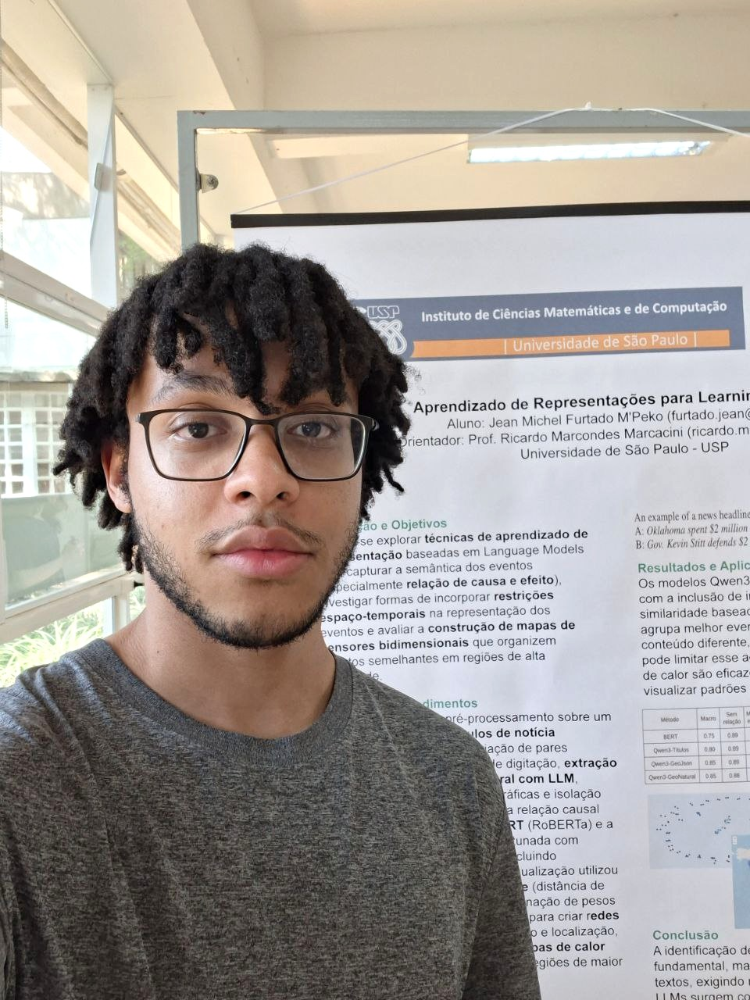

### Bem vindo! 👋
***

 

### Projetos
- 2025 - Iniciação Científica: Análise de Causalidade Intersentença com LLMs e Métodos de Visualização de Eventos
  - https://github.com/furtadojean/CausalityLearningToSense
- 2024: Biblioteca de Criação de Cenários 3D com OpenGL + Minecraft Simplificado
  - https://github.com/furtadojean/Necramtfi
  - https://www.youtube.com/watch?v=5w5zoETEjNw
  - https://www.youtube.com/watch?v=1qE3UyN29vg
- 2024: Plataforma Web para Simulação de Pipeline e Assembly
  - https://github.com/furtadojean/SIMPA
- 2023: Plataforma Web para Compra de Passagens Aéreas
  - https://github.com/furtadojean/FlightSales
- 2022: Algoritmo Genético para Resolução de Equações do Quinto Grau
  - https://github.com/furtadojean/Genetic-Algorithm
  - https://www.youtube.com/watch?v=U1nD1UlWllA

<!-- 

 -->

<!-- ### [Como usar linux nos labs?](https://github.com/furtadojean/labs-linux) -->
   

<!--
**furtadojean/furtadojean** is a ✨ _special_ ✨ repository because its `README.md` (this file) appears on your GitHub profile.

Here are some ideas to get you started:

- 🔭 I’m currently working on ...
- 🌱 I’m currently learning ...
- 👯 I’m looking to collaborate on ...
- 🤔 I’m looking for help with ...
- 💬 Ask me about ...
- 📫 How to reach me: ...
- 😄 Pronouns: ...
- ⚡ Fun fact: ...
-->
